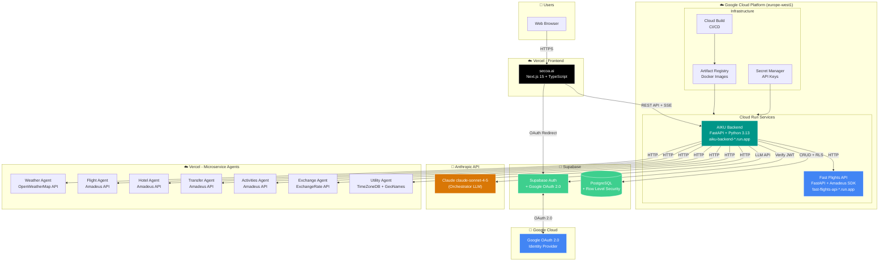
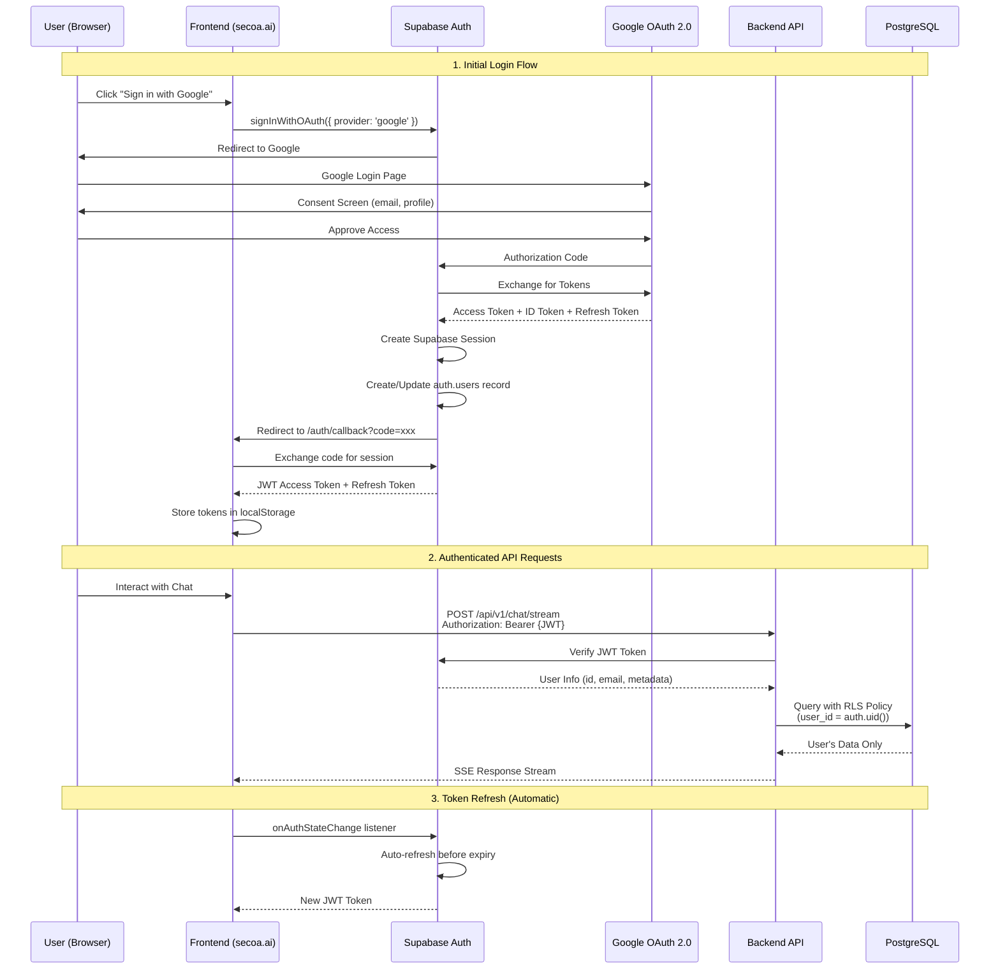
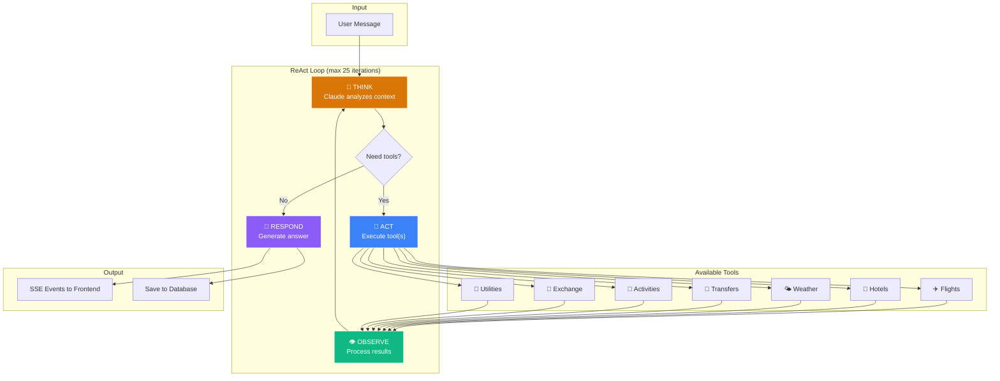
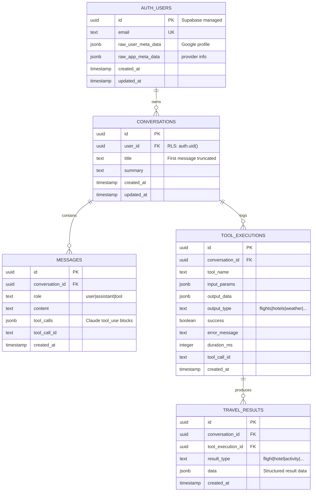
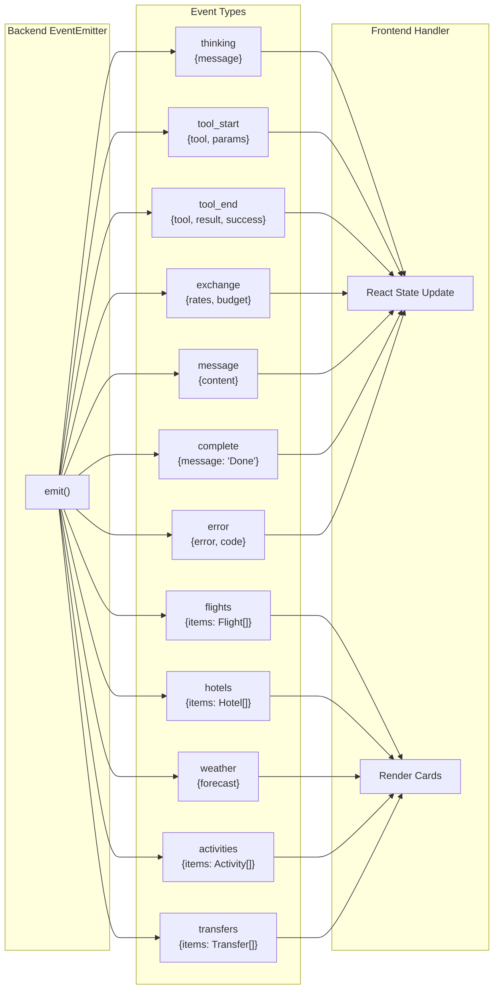
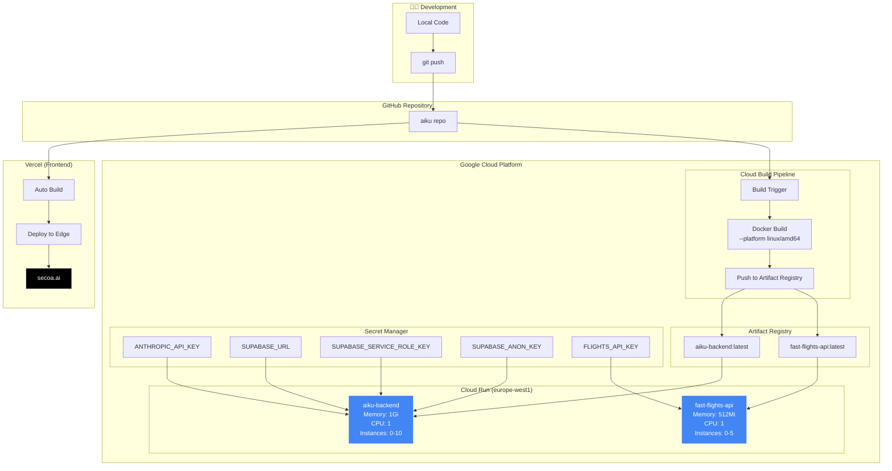
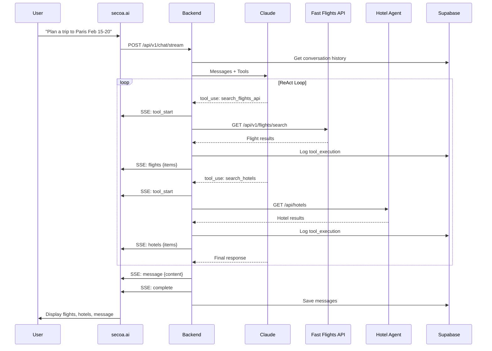

# AIKU Travel Agent - Complete Architecture Documentation

## Overview

**AIKU** (AI Knowledge Utility) is an AI-powered travel planning assistant built with a modern cloud-native microservices architecture. It uses **Anthropic Claude** as the orchestrating LLM with **8 specialized microservices** for travel functionality.

**Live URL:** https://secoa.ai

---

## 1. High-Level System Architecture



---

## 2. All Services & URLs

### Production Endpoints

| Service | URL | Platform | Tech Stack |
|---------|-----|----------|------------|
| **Frontend** | https://secoa.ai | Vercel | Next.js 15, TypeScript, Tailwind |
| **Backend API** | https://aiku-backend-899018378108.europe-west1.run.app | GCP Cloud Run | FastAPI, Python 3.13 |
| **Fast Flights API** | https://fast-flights-api-1042410626896.europe-west1.run.app | GCP Cloud Run | FastAPI, Amadeus SDK |
| **Weather Agent** | https://weather-agent-seven.vercel.app | Vercel | Next.js API Routes |
| **Flight Agent** | https://flight-agent.vercel.app | Vercel | Next.js API Routes |
| **Hotel Agent** | https://hotel-agent-delta.vercel.app | Vercel | Next.js API Routes |
| **Transfer Agent** | https://transfer-agent.vercel.app | Vercel | Next.js API Routes |
| **Activities Agent** | https://activities-agent.vercel.app | Vercel | Next.js API Routes |
| **Exchange Agent** | https://exchange-agent.vercel.app | Vercel | Next.js API Routes |
| **Utility Agent** | https://utility-agent.vercel.app | Vercel | Next.js API Routes |
| **Supabase** | https://ixjgkcabzhrriektaotm.supabase.co | Supabase | PostgreSQL 15 |

---

## 3. Agent Architecture with External APIs

```mermaid
flowchart TB
    subgraph Orchestrator["🧠 AIKU Backend (Cloud Run)"]
        TravelAgent["TravelAgentOrchestrator<br/>ReAct Pattern"]
        AnthropicLLM["AnthropicLLM<br/>claude-sonnet-4-5-20250929"]
        ToolRegistry["Tool Registry<br/>18 Tools"]
    end

    subgraph FlightServices["✈️ Flight Services"]
        direction TB
        FlightTool["SearchFlightsTool<br/>AnalyzeFlightPricesTool"]
        FlightsAPITool["FlightsAPITool"]

        subgraph FlightAgentBox["Flight Agent (Vercel)"]
            FA_API["flight-agent.vercel.app"]
            FA_Amadeus["Amadeus Flight Offers API"]
        end

        subgraph FastFlightsBox["Fast Flights API (Cloud Run)"]
            FF_API["fast-flights-api-*.run.app"]
            FF_Amadeus["Amadeus Flight Offers Search v2"]
            FF_Key["API Key: ff-2026-*"]
        end
    end

    subgraph HotelServices["🏨 Hotel Services"]
        HotelTool["SearchHotelsTool<br/>GetHotelOffersTool"]
        subgraph HotelAgentBox["Hotel Agent (Vercel)"]
            HA_API["hotel-agent-delta.vercel.app"]
            HA_Amadeus["Amadeus Hotel List API<br/>Amadeus Hotel Offers API"]
        end
    end

    subgraph WeatherServices["🌤️ Weather Services"]
        WeatherTool["WeatherTool"]
        subgraph WeatherAgentBox["Weather Agent (Vercel)"]
            WA_API["weather-agent-seven.vercel.app"]
            WA_OWM["OpenWeatherMap API<br/>5-day Forecast"]
        end
    end

    subgraph TransferServices["🚕 Transfer Services"]
        TransferTool["SearchTransfersTool"]
        subgraph TransferAgentBox["Transfer Agent (Vercel)"]
            TA_API["transfer-agent.vercel.app"]
            TA_Amadeus["Amadeus Transfer API"]
        end
    end

    subgraph ActivityServices["🎯 Activity Services"]
        ActivityTool["SearchActivitiesTool"]
        subgraph ActivityAgentBox["Activities Agent (Vercel)"]
            AA_API["activities-agent.vercel.app"]
            AA_Amadeus["Amadeus Tours & Activities API"]
        end
    end

    subgraph ExchangeServices["💱 Exchange Services"]
        ExchangeTool["ConvertCurrencyTool<br/>GetExchangeRatesTool<br/>CalculateTravelBudgetTool"]
        subgraph ExchangeAgentBox["Exchange Agent (Vercel)"]
            EA_API["exchange-agent.vercel.app"]
            EA_XR["ExchangeRate-API<br/>Open Exchange Rates"]
        end
    end

    subgraph UtilityServices["🔧 Utility Services"]
        UtilityTool["GetCityTimeTool<br/>GetDistanceTool<br/>LookupIATACodeTool<br/>+ 5 more tools"]
        subgraph UtilityAgentBox["Utility Agent (Vercel)"]
            UA_API["utility-agent.vercel.app"]
            UA_APIs["TimeZoneDB API<br/>GeoNames API<br/>IATA Database"]
        end
    end

    TravelAgent --> AnthropicLLM
    TravelAgent --> ToolRegistry

    ToolRegistry --> FlightTool
    ToolRegistry --> FlightsAPITool
    ToolRegistry --> HotelTool
    ToolRegistry --> WeatherTool
    ToolRegistry --> TransferTool
    ToolRegistry --> ActivityTool
    ToolRegistry --> ExchangeTool
    ToolRegistry --> UtilityTool

    FlightTool --> FA_API
    FA_API --> FA_Amadeus

    FlightsAPITool --> FF_API
    FF_API --> FF_Amadeus

    HotelTool --> HA_API
    HA_API --> HA_Amadeus

    WeatherTool --> WA_API
    WA_API --> WA_OWM

    TransferTool --> TA_API
    TA_API --> TA_Amadeus

    ActivityTool --> AA_API
    AA_API --> AA_Amadeus

    ExchangeTool --> EA_API
    EA_API --> EA_XR

    UtilityTool --> UA_API
    UA_API --> UA_APIs

    style TravelAgent fill:#D97706,stroke:#fff,color:#fff
    style AnthropicLLM fill:#D97706,stroke:#fff,color:#fff
    style FF_API fill:#4285F4,stroke:#fff,color:#fff
```



---

## 4. AI Models & LLM Configuration

### Anthropic Claude Models Used

| Model | Model ID | Usage | Pricing (per MTok) |
|-------|----------|-------|-------------------|
| **Claude Sonnet 4.5** | `claude-sonnet-4-5-20250929` | Default orchestrator | $3 input / $15 output |
| Claude Opus 4.5 | `claude-opus-4-5-20251101` | Complex reasoning (optional) | $15 input / $75 output |
| Claude Haiku 4.5 | `claude-haiku-4-5-20251001` | Fast, simple tasks | $1 input / $5 output |

### LLM Configuration

```python
# Backend Configuration (app/config.py)
DEFAULT_LLM_MODEL = "claude-sonnet-4-5-20250929"
LLM_MAX_TOKENS = 4096
LLM_TEMPERATURE = 0.7
LLM_MAX_ITERATIONS = 25  # ReAct loop limit
```

### Tool Use Format

Claude uses **native tool use** (function calling) with JSON schemas:

```json
{
  "name": "search_flights",
  "description": "Search for flights between airports",
  "input_schema": {
    "type": "object",
    "properties": {
      "origin": { "type": "string", "description": "IATA code" },
      "destination": { "type": "string", "description": "IATA code" },
      "date": { "type": "string", "format": "date" }
    },
    "required": ["origin", "destination", "date"]
  }
}
```

---

## 5. Google OAuth 2.0 Authentication Flow



### OAuth Configuration

**Google Cloud Console:**
- Project: `fast-flights-api-2026`
- OAuth 2.0 Client ID: Web application
- Authorized redirect URIs:
  - `https://ixjgkcabzhrriektaotm.supabase.co/auth/v1/callback`

**Supabase Auth Settings:**
- Provider: Google
- Client ID: `xxx.apps.googleusercontent.com`
- Client Secret: `GOCSPX-xxx`
- Scopes: `email`, `profile`, `openid`

**JWT Token Structure:**
```json
{
  "aud": "authenticated",
  "exp": 1704067200,
  "sub": "uuid-user-id",
  "email": "user@gmail.com",
  "app_metadata": {
    "provider": "google"
  },
  "user_metadata": {
    "full_name": "User Name",
    "avatar_url": "https://...",
    "email_verified": true
  }
}
```

---

## 6. Complete Tool Registry

| Tool Name | Description | Agent | External API |
|-----------|-------------|-------|--------------|
| `search_flights` | Search flights between airports | Flight Agent | Amadeus Flight Offers |
| `analyze_flight_prices` | Analyze price trends | Flight Agent | Amadeus Flight Prices |
| `search_flights_api` | Direct flight search (faster) | **Fast Flights API** | Amadeus Flight Offers v2 |
| `search_hotels` | Search hotels by city | Hotel Agent | Amadeus Hotel List |
| `get_hotel_offers` | Get room prices and offers | Hotel Agent | Amadeus Hotel Offers |
| `get_weather_forecast` | Weather for travel dates | Weather Agent | OpenWeatherMap 5-day |
| `search_transfers` | Airport/city transfers | Transfer Agent | Amadeus Transfer |
| `search_activities` | Tours and activities | Activities Agent | Amadeus Tours & Activities |
| `convert_currency` | Currency conversion | Exchange Agent | ExchangeRate-API |
| `get_exchange_rates` | Current exchange rates | Exchange Agent | ExchangeRate-API |
| `calculate_travel_budget` | Budget in destination currency | Exchange Agent | ExchangeRate-API |
| `get_city_time` | Current time in city | Utility Agent | TimeZoneDB |
| `get_time_difference` | Time difference between cities | Utility Agent | TimeZoneDB |
| `get_country_info` | Country information | Utility Agent | REST Countries |
| `get_distance` | Distance between locations | Utility Agent | Haversine + GeoNames |
| `get_days_between` | Days between dates | Utility Agent | Native calculation |
| `lookup_iata_code` | Airport IATA code lookup | Utility Agent | IATA Database |
| `search_iata_by_city` | Search airports by city | Utility Agent | IATA Database |

---

## 7. ReAct Orchestration Pattern



---

## 8. Database Schema (Supabase PostgreSQL)



### Row Level Security (RLS) Policies

```sql
-- Users can only see their own conversations
CREATE POLICY "Users view own conversations" ON conversations
    FOR SELECT USING (auth.uid() = user_id);

-- Users can only insert their own conversations
CREATE POLICY "Users insert own conversations" ON conversations
    FOR INSERT WITH CHECK (auth.uid() = user_id);

-- Similar policies for messages, tool_executions, travel_results
```

---

## 9. SSE Event Types



---

## 10. Deployment Architecture



---

## 11. Technology Stack Summary

```
┌─────────────────────────────────────────────────────────────────────────────┐
│                           FRONTEND (secoa.ai)                                │
├─────────────────────────────────────────────────────────────────────────────┤
│  Framework: Next.js 15 (App Router)                                          │
│  Language: TypeScript 5.x                                                    │
│  Styling: Tailwind CSS + shadcn/ui                                          │
│  State: Zustand + TanStack Query                                            │
│  Animation: Framer Motion                                                    │
│  Auth: Supabase Auth (@supabase/supabase-js)                                │
│  Hosting: Vercel (Edge Network)                                             │
└─────────────────────────────────────────────────────────────────────────────┘
                                    │
                              HTTPS + SSE
                                    │
                                    ▼
┌─────────────────────────────────────────────────────────────────────────────┐
│                           BACKEND (Cloud Run)                                │
├─────────────────────────────────────────────────────────────────────────────┤
│  Framework: FastAPI 0.115.x                                                  │
│  Language: Python 3.13                                                       │
│  Server: Uvicorn (ASGI)                                                      │
│  Validation: Pydantic v2                                                     │
│  HTTP Client: httpx (async)                                                  │
│  Streaming: Server-Sent Events (SSE)                                         │
│  Container: Docker (linux/amd64)                                             │
└─────────────────────────────────────────────────────────────────────────────┘
                                    │
                              Anthropic API
                                    │
                                    ▼
┌─────────────────────────────────────────────────────────────────────────────┐
│                            AI / LLM LAYER                                    │
├─────────────────────────────────────────────────────────────────────────────┤
│  Provider: Anthropic                                                         │
│  Model: claude-sonnet-4-5-20250929 (default)                                │
│  Pattern: ReAct (Reason + Act)                                              │
│  Features: Native Tool Use, Streaming, Multi-turn Context                   │
│  Max Tokens: 4096 per response                                              │
│  Temperature: 0.7                                                            │
└─────────────────────────────────────────────────────────────────────────────┘
                                    │
                              HTTP + API Keys
                                    │
                                    ▼
┌─────────────────────────────────────────────────────────────────────────────┐
│                        EXTERNAL APIS (via Agents)                            │
├─────────────────────────────────────────────────────────────────────────────┤
│  Amadeus for Developers: Flights, Hotels, Transfers, Activities             │
│  OpenWeatherMap: Weather Forecasts                                           │
│  ExchangeRate-API: Currency Conversion                                       │
│  TimeZoneDB: Time Zone Data                                                  │
│  GeoNames: Geographic Data                                                   │
│  Google OAuth 2.0: Authentication                                            │
└─────────────────────────────────────────────────────────────────────────────┘
                                    │
                              Supabase Client
                                    │
                                    ▼
┌─────────────────────────────────────────────────────────────────────────────┐
│                              DATABASE                                        │
├─────────────────────────────────────────────────────────────────────────────┤
│  Provider: Supabase                                                          │
│  Database: PostgreSQL 15                                                     │
│  Auth: Supabase Auth + Google OAuth 2.0                                     │
│  Security: Row Level Security (RLS)                                         │
│  Tables: conversations, messages, tool_executions, travel_results           │
└─────────────────────────────────────────────────────────────────────────────┘
                                    │
                                    ▼
┌─────────────────────────────────────────────────────────────────────────────┐
│                         CLOUD INFRASTRUCTURE                                 │
├─────────────────────────────────────────────────────────────────────────────┤
│  ┌──────────────────────┐  ┌──────────────────────┐  ┌──────────────────┐  │
│  │   Google Cloud       │  │      Vercel          │  │    Supabase      │  │
│  │   Platform           │  │                      │  │                  │  │
│  │   ─────────────      │  │   ─────────────      │  │   ─────────      │  │
│  │   • Cloud Run        │  │   • Frontend Host    │  │   • PostgreSQL   │  │
│  │   • Artifact Reg.    │  │   • Edge Network     │  │   • Auth         │  │
│  │   • Cloud Build      │  │   • Auto Deploy      │  │   • Realtime     │  │
│  │   • Secret Manager   │  │   • Agent Hosting    │  │   • Storage      │  │
│  │   • IAM              │  │   • SSL/TLS          │  │   • RLS          │  │
│  └──────────────────────┘  └──────────────────────┘  └──────────────────┘  │
└─────────────────────────────────────────────────────────────────────────────┘
```

---

## 12. Environment Variables

### Backend (.env)

```bash
# Application
APP_NAME=AIKU Travel Agent
APP_ENV=production
APP_DEBUG=false
API_VERSION=v1
HOST=0.0.0.0
PORT=8080

# Supabase
SUPABASE_URL=https://ixjgkcabzhrriektaotm.supabase.co
SUPABASE_ANON_KEY=eyJhbGc...
SUPABASE_SERVICE_ROLE_KEY=eyJhbGc...

# Anthropic LLM
ANTHROPIC_API_KEY=sk-ant-...
DEFAULT_LLM_MODEL=claude-sonnet-4-5-20250929
LLM_MAX_TOKENS=4096
LLM_TEMPERATURE=0.7
LLM_MAX_ITERATIONS=25

# Fast Flights API (GCP Cloud Run)
FLIGHTS_API_URL=https://fast-flights-api-1042410626896.europe-west1.run.app
FLIGHTS_API_KEY=your-flights-api-key

# External Agents (Vercel)
WEATHER_AGENT_URL=https://weather-agent-seven.vercel.app
FLIGHT_AGENT_URL=https://flight-agent.vercel.app
HOTEL_AGENT_URL=https://hotel-agent-delta.vercel.app
TRANSFER_AGENT_URL=https://transfer-agent.vercel.app
ACTIVITIES_AGENT_URL=https://activities-agent.vercel.app
EXCHANGE_AGENT_URL=https://exchange-agent.vercel.app
UTILITY_AGENT_URL=https://utility-agent.vercel.app

# CORS
CORS_ORIGINS=["https://secoa.ai","http://localhost:3000"]
```

### Frontend (.env.local)

```bash
NEXT_PUBLIC_SUPABASE_URL=https://ixjgkcabzhrriektaotm.supabase.co
NEXT_PUBLIC_SUPABASE_ANON_KEY=eyJhbGc...
NEXT_PUBLIC_API_URL=https://aiku-backend-899018378108.europe-west1.run.app
```

---

## 13. Data Flow Example



---

*Generated: January 2026 | AIKU v1.0*
