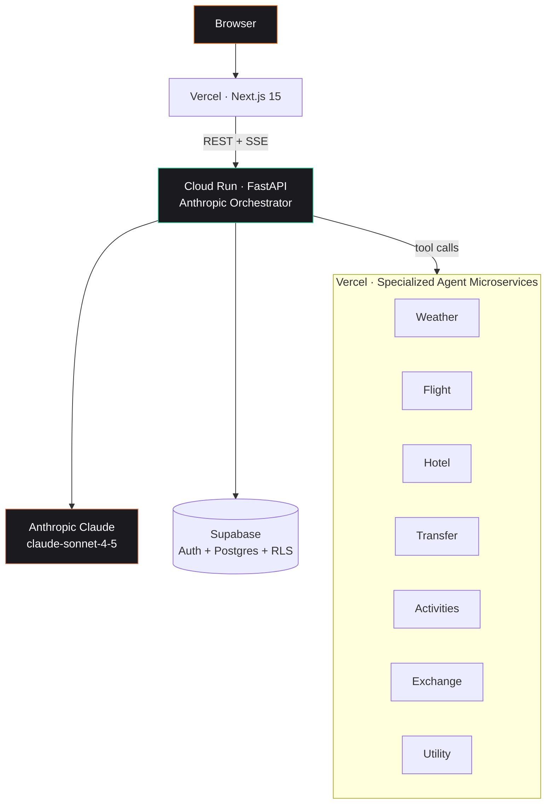

# AIKU — Senior Design Project Backend

> Multi-agent travel planning backend. 8 specialized microservices coordinated by an LLM orchestrator (Anthropic Claude).

[](https://fastapi.tiangolo.com/)
[](https://www.python.org/)
[](https://www.anthropic.com/)
[](https://supabase.com/)
[](https://cloud.google.com/run)

---

## What this is

The backend half of the [AIKU Senior Design Project](https://github.com/Comp491-aiku) at Koç University. A production-deployed multi-agent travel planning system with Claude as the orchestrator and 8 specialized microservices for weather, flights, hotels, transfers, activities, currency, and utilities.

**Frontend:** [senior-frontend](https://github.com/Comp491-aiku/senior-frontend)
**Architecture deep-dive:** [`ARCHITECTURE.md`](ARCHITECTURE.md) (31 KB, full diagrams)

---

## High-level architecture



---

## Why it's interesting

This isn't a tutorial project — it's a **deployed production system** with the same architectural DNA as commercial AI orchestration platforms:

- **LLM-as-orchestrator** pattern — Claude decides which microservice to call, in what order
- **Tool-calling architecture** — each agent exposes a tool surface that Claude invokes
- **Microservice-per-domain** — independent agents on Vercel, scaled separately
- **Server-Sent Events** for streaming itinerary generation
- **Row-Level Security** in Postgres for multi-tenant data isolation
- **CI/CD** through Cloud Build → Artifact Registry → Cloud Run

The same patterns later informed [Mindra](https://mindra.co), the multi-agent orchestration platform that now runs on this foundation.

---

## Live infrastructure

| Layer | Where | What |
|---|---|---|
| Frontend | Vercel (global) | Next.js 15 · TypeScript |
| Backend | Cloud Run (europe-west1) | FastAPI · Python 3.13 |
| Flight microservice | Cloud Run | Amadeus SDK wrapper |
| Agent microservices ×7 | Vercel | Per-domain serverless functions |
| Database | Supabase | PostgreSQL + Row Level Security |
| Auth | Supabase + Google OAuth 2.0 | |
| LLM | Anthropic Claude | claude-sonnet-4-5 |
| Secrets | Google Secret Manager | API keys |
| CI/CD | Cloud Build | Artifact Registry deploys |

---

## The 8 specialized agents

| Agent | Provider | Purpose |
|---|---|---|
| **Orchestrator** | Anthropic Claude | Plans, delegates, synthesizes |
| **Weather** | OpenWeatherMap | Per-destination forecasts |
| **Flight** | Amadeus | Search + price rank |
| **Hotel** | Amadeus | Search + filter |
| **Transfer** | Amadeus | Ground transport |
| **Activities** | Amadeus + Foursquare | POI + attractions |
| **Exchange** | ExchangeRate API | Currency conversion |
| **Utility** | TimeZoneDB + GeoNames | Time, geocoding |

---

## Project structure

```
app/
├── api/                       # FastAPI routes (REST + SSE)
├── agentic/
│   ├── orchestrator/          # Travel agent + planning loop
│   ├── llm/                   # Anthropic + OpenAI adapters
│   ├── tools/
│   │   └── travel/            # Weather, flights, hotels, transfers, activities...
│   ├── history/               # Conversation persistence
│   └── events/                # SSE event emitter
├── core/                      # Auth, permissions, exceptions
├── db/                        # SQLAlchemy + Supabase client
├── config.py
└── main.py
migrations/                    # Alembic database migrations
tests/                         # Unit + integration + e2e
ARCHITECTURE.md                # 31KB system-design deep dive
deploy-v2.sh                   # Cloud Run deploy script
cloudbuild.yaml                # Cloud Build CI/CD
```

---

## Quick start

### Prerequisites
- Python 3.11+
- PostgreSQL (or Supabase project)
- Anthropic API key
- Amadeus, Foursquare, OpenWeather, SerpApi keys (see `.env.example`)

### Run locally

```bash
git clone https://github.com/Comp491-aiku/senior-backend.git
cd senior-backend

python -m venv venv && source venv/bin/activate
pip install -r requirements.txt

cp .env.example .env   # fill in API keys
alembic upgrade head   # run migrations

uvicorn main:app --reload --host 0.0.0.0 --port 8000
# Docs: http://localhost:8000/docs
```

### Docker

```bash
docker build -t aiku-backend .
docker run -p 8000:8000 --env-file .env aiku-backend
```

### Deploy to Cloud Run

```bash
./deploy-v2.sh
```

---

## Selected API surface

| Method | Endpoint | Purpose |
|---|---|---|
| `POST` | `/api/trips` | Create new trip |
| `POST` | `/api/trips/{id}/itinerary/generate` | AI-orchestrated itinerary build (SSE stream) |
| `GET`  | `/api/trips/{id}` | Trip detail + itinerary |
| `GET`  | `/api/flights/search` | Flight search via orchestrator |
| `GET`  | `/api/accommodations/search` | Hotel search |
| `GET`  | `/api/weather` | Per-destination forecast |
| `GET`  | `/docs` | OpenAPI / Swagger UI |

---

## Architecture notes

For the full system design including auth flow, microservice contracts, deployment topology, and SSE event schema, see [`ARCHITECTURE.md`](ARCHITECTURE.md).

---

## Team

Built by the **Comp491-aiku Senior Design team** at Koç University.

---

## Author (this repo's README)

**İlker Yörü** — CTO @ [Mindra](https://mindra.co)
[GitHub](https://github.com/1lker) · [LinkedIn](https://linkedin.com/in/ilker-yoru) · [ilkeryoru.com](https://ilkeryoru.com)

## License

MIT
